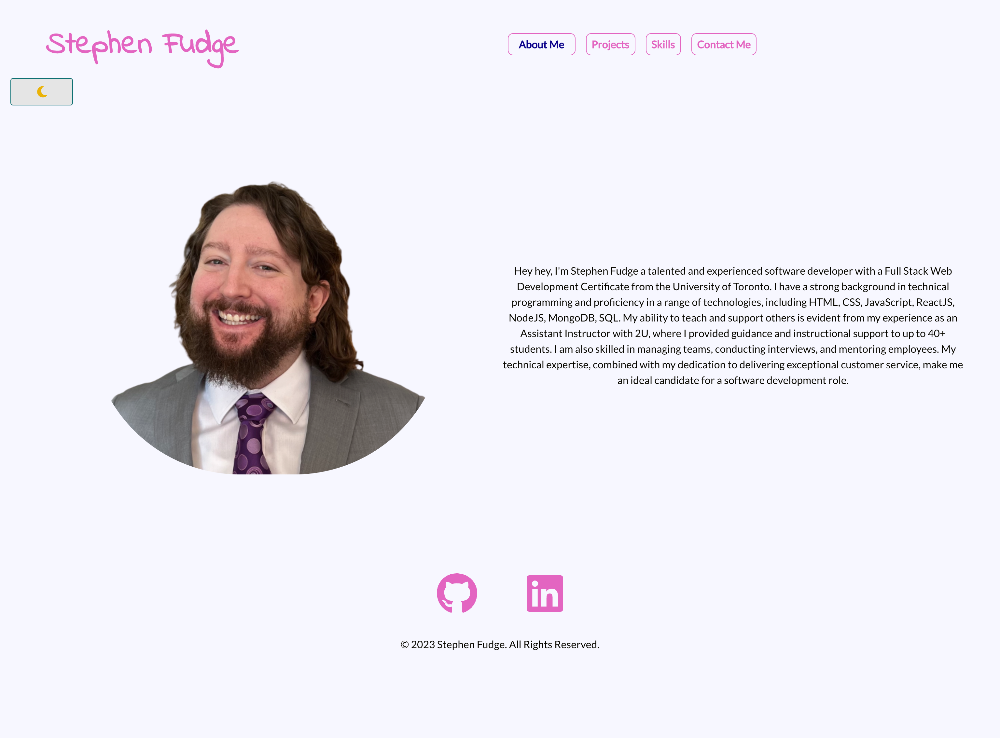

# My Personal Portfolio

Welcome to my personal portfolio website! I built this website using React, TailwindCSS, DaisyUI, react-spring npm package, and FontAwesome Icons.

## Table of Contents
- [Demo](#demo)
- [Features](#features)
- [Design](#design)
- [Testing](#testing)
- [Credits](#credits)
- [License](#license)
- [Contact](#contact)

## Demo

Here's a [link](https://stephenfudge-portfolio.vercel.app/) to the deployed website.

## Features

My portfolio includes the following features:

- **Homepage**: An introduction to myself and my skills.

- **Projects**: A showcase of my projects with screenshots, descriptions, and links to the live websites and GitHub repositories.

- **Skills**: A list of my technical skills.

- **Resume**: A PDF version of my resume.

- **Contact**: A contact form for visitors to get in touch with me.

## Design

The website design features a sleek and modern aesthetic, with a focus on showcasing the web developer's portfolio and skills. The color scheme is primarily black, white, and shades of grey, with pops of pink, purple and blue for added visual interest. The layout is optimized for both desktop and mobile devices, and includes a light and dark mode to enhance user experience.

This is at a laptop screen size in light mode

 

This is at a mobile screen size in dark mode

## Testing

To ensure the quality and reliability of my portfolio website, I have created unit tests for each page and component. These tests cover various aspects such as functionality, rendering, and user interactions. By conducting thorough testing, I can confidently identify and address any issues or bugs that may arise.

Additionally, I tested the portfolio [here](https://www.toptal.com/designers/colorfilter) to ensure that the contrast between text and background was good for users who may be colorblind.

## Credits

The portfolio was built using the following tools and libraries:

- React
- TailwindCSS
- DaisyUI
- react-spring npm package
- FontAwesome Icons
- https://www.toptal.com/designers/colorfilter

## License

The portfolio is licensed under the MIT License. See `LICENSE` for more information.

## Contact

If you have any questions or feedback, feel free to [contact me ](sfudge@gmail.com).

